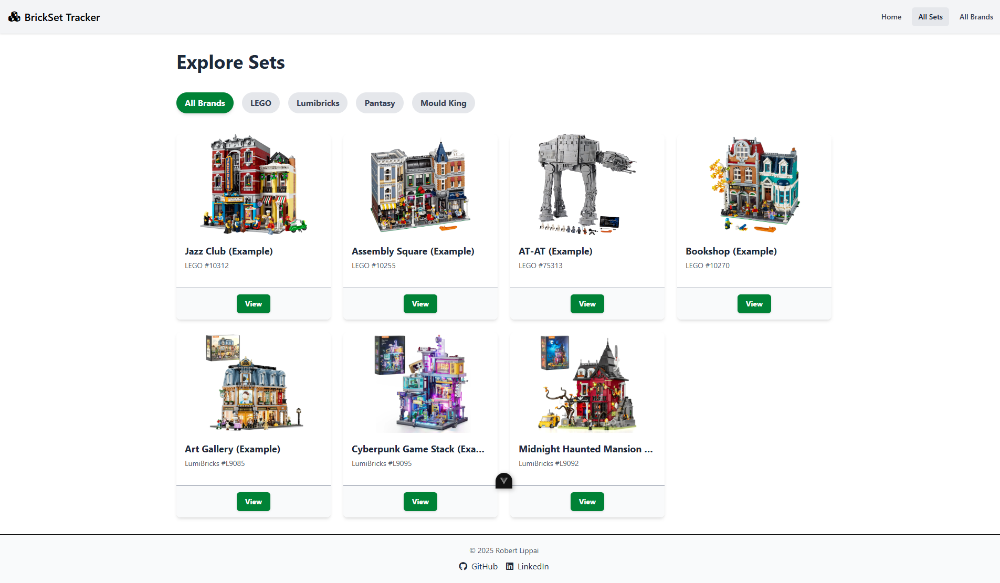

# Brickset Tracker - Vue Frontend


This is the Vue 3 frontend for my BricksetTracker project. It connects to the [Brickset Tracker - Spring Boot API](https://github.com/RobertLippai/brickset-tracker-api), letting users search for and keep track of their brick sets.

## Live Demo

**You can try the live application here:**
**[https://brickset-tracker.vercel.app/](https://brickset-tracker.vercel.app/)**

_(Please note: The backend API is hosted on a free-tier service and may take 15-30 seconds to "wake up" on the first visit.)_

## Features
* **Full User Authentication:** Secure user registration and login using JWT. The application state is managed globally with Pinia.
* **Personal Inventory Management:** Authenticated users can view their personal collection, add new sets from the main catalog, and remove sets from their inventory.
* **Dynamic Set Catalog:** Fetches and displays brick sets from the backend API.
* **Interactive Filtering:** Users can filter the set catalog by brand in real-time. The UI reactively updates based on URL query parameters.
* **Robust Data Fetching & Error Handling:** Uses `axios` for API calls, includes loading states, and gracefully falls back to placeholder data if the API is unavailable.
* **Responsive Design:** Works on both desktop and mobile, featuring a collapsible hamburger menu.
* **Component-Based Architecture:** Reusable components for the Navbar, Footer, Hero Section, Set List and cards.
* **Deployment:** Continuous Deployment with **Vercel**. Every push automatically triggers a new production build and deployment. Vercel's rewrite feature is used to proxy backend API calls.

## Tech Stack
* Vue 3
* Vue Router
* Pinia
* Vite
* JavaScript
* Axios
* Tailwind CSS
* Font Awesome

## Screenshots
<details>
<summary>Click to view screenshots</summary>

<div align="center">
  <p><strong>Homepage (Guest View)</strong></p>
  
</div>

<div align="center">
  <p><strong>Homepage (Authenticated View)</strong></p>
  
</div>

<div align="center">
  <p><strong>Explore Sets Page</strong></p>
  
</div>

<div align="center">
  <p><strong>Set Details Page</strong></p>
  
</div>

<div align="center">
  <p><strong>User Inventory Page</strong></p>
  
</div>

</details>

## Roadmap
- [x] **Layout Foundation:** Create a responsive main layout with a navigation bar and footer.
- [x] **Explore Sets Page:** Display all sets from the API in a responsive grid with brand filtering.
- [x] **Set Detail Page:** Display detailed information about a set.
- [x] **Explore Brands Page:** Display all brands from the API in a responsive grid.
- [x] **User Authentication:** Implement JWT-based registration and login..
- [x] **User Inventory Management:** Allow users to view, add and remove sets from their personal collection.
- [ ] **Admin Panels:** (Future) Provide UI for users with `EDITOR` or `ADMIN` roles to manage Sets, Brands, Tags and Comments.

## Project Setup

### Prerequisites

- Node.js (v18 or newer)
- npm

### Installation and Development
1.  Clone the repository:
    ```sh
    git clone https://github.com/RobertLippai/brickset-tracker-frontend.git
    ```

2.  Navigate into the project directory:
    ```sh
    cd brickset-tracker-frontend
    ```

3.  Install the dependencies:
    ```sh
    npm install
    ```

4.  Compile and run the hot-reloading dev server:
    ```sh
    npm run dev
    ```

## Disclaimer
> This project was created to showcase my work. The LEGO® sets and other brand assets (Lumibricks, Pantasy, etc.) shown are used for illustrative and demonstration purposes only. All trademarks and copyrights are the property of their respective owners. No copyright infringement is intended.

## Credits
- Mourizal Zativa -- bricks_1.jpeg: [Link](https://unsplash.com/photos/blue-red-and-yellow-lego-blocks-OSvN1fBcXYE)
- Xavi Cabrera -- bricks_2.jpeg: [Link](https://unsplash.com/photos/yellow-red-blue-and-green-lego-blocks-kn-UmDZQDjM)
